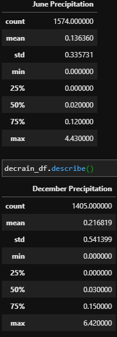

# Surfs Up!

## Overview
* The purpose of this analysis was to compile the temperature trends for the months of June and December in Oahu.
* The results are to help determine the year-round sustainability of a surf and ice cream business.
* The results were achieved using Python, Pandas functions along with SQLAlchemy to filter data from a SQLite database.

## Results
* June has 1700 total temperature observations, compared to December at 1517. There is a difference of 183 observations between the two. Regardless, this still leaves a solid dataset.
* Mean temperature for June is almost 4 degrees higher at 74.94 compared to 71.04 for December. The median temperature for June is 75 compared to 71 for Decmeber. Both central tendency measurements for June and December are similar and shows that there is little difference in the average temperature between the two months.
* The only major difference between the two months is the low temperature for December is 56 compared to 64 for June. Even though the lowest temperature recorded for December is 8 degrees below the same for June, this is not a big deal when looking at the mean temperatures and the similar standard deviations for the two datasets

## Summary
* When comparing the temperature differences between the months of June and December, we also get a decent look at the temperature differences between to drastically different seasons in the summer and winter. The results show us that there is not a major difference in the day-to-day temperatures between the two months. While December will be a little cooler, it will only be by a few degrees.
* The below image shows the descriptive statistics for precipitation in June and December.

* In the same vein as the temperature results, there is not a large difference between the two months.The mean precipitation amount is less than 0.1 apart.
* Both months' standard deviation are less than 1, showing that the data very reliable
In the end the data shows us that Oahu is a great location to be the home of the surf and ice cream shop. It has predictable weather that is warm and mostly dry.

